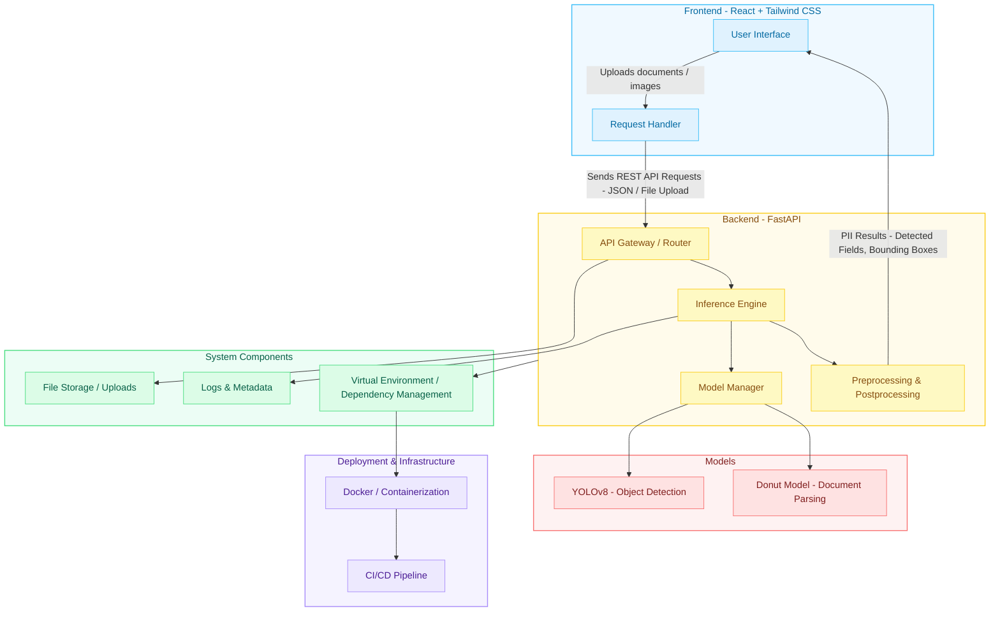

# PII Identification System

The PII (Personally Identifiable Information) Identification System is an end-to-end application designed to detect sensitive information using **Donut model & YOLOv8**. It provides a scalable **FastAPI backend** for model inference and API management, along with a modern **React + Tailwind CSS frontend** for user interaction.

---

## Features

* PII detection powered by YOLOv8 object detection.
* REST API backend built with FastAPI for high-performance inference.
* React-based frontend with Tailwind CSS for a clean and responsive interface.
* Modular architecture separating backend and frontend for ease of development and deployment.
* Support for virtual environments and reproducible dependency management.

---

## Tech Stack

**Backend**

* FastAPI (REST API framework)
* YOLOv8 (Ultralytics) for object detection
* Python 3.9+

**Frontend**

* React
* Tailwind CSS

**Other**

* Node.js & npm
* Python virtual environment (`venv`)

---

## Project Structure

```
PII-Identification-System/
├── backend
│   ├── main.py              # FastAPI application entry point
│   ├── requirements.txt     # Python dependencies
│   ├── weights/             # YOLOv8 model weights
│   └── venv/                # Python virtual environment (ignored in Git)
│
├── frontend
│   ├── src/                 # React components
│   ├── public/              # Static files
│   ├── package.json         # Frontend dependencies
│   ├── tailwind.config.js   # Tailwind configuration
│   └── postcss.config.js    # PostCSS configuration
│
├── .gitignore
├── README.md
└── package.json
```

---

## Setup Instructions

### 1. Clone the Repository

```bash
git clone https://github.com/<your-username>/<your-repo>.git
cd <your-repo>
```

### 2. Backend Setup

```bash
cd backend

# Create virtual environment
python -m venv venv

# Activate environment
source venv/bin/activate   # Linux/Mac
venv\Scripts\activate      # Windows

# Install dependencies
pip install -r requirements.txt

# Run FastAPI server
uvicorn main:app --reload
```

The backend will be available at: `http://127.0.0.1:8000`

### 3. Frontend Setup

```bash
cd frontend

# Install dependencies
npm install

# Start development server
npm start
```

The frontend will be available at: `http://localhost:3000`

---

## Usage

1. Start both the backend and frontend servers.
2. Open the frontend in your browser at `http://localhost:3000`.
3. Upload an image or document containing sensitive information.
4. The system will run inference and display detected PII regions.

---

## API Endpoints

| Method | Endpoint    | Description                                                  |
| ------ | ----------- | ------------------------------------------------------------ |
| POST   | `/predict/` | Accepts an image for inference and returns detected PII data |
| GET    | `/health/`  | Health check endpoint                                        |

---

## Dependencies

* **Backend**: FastAPI, Uvicorn, Ultralytics (YOLOv8), Pydantic
* **Frontend**: React, Tailwind CSS

For the full list, refer to `requirements.txt` and `package.json`.

---

## Architecture



## Contributing

Contributions are encouraged. Please fork the repository, make your changes, and submit a pull request for review.

---

## License

This project is licensed under the MIT License. See the LICENSE file for details.

